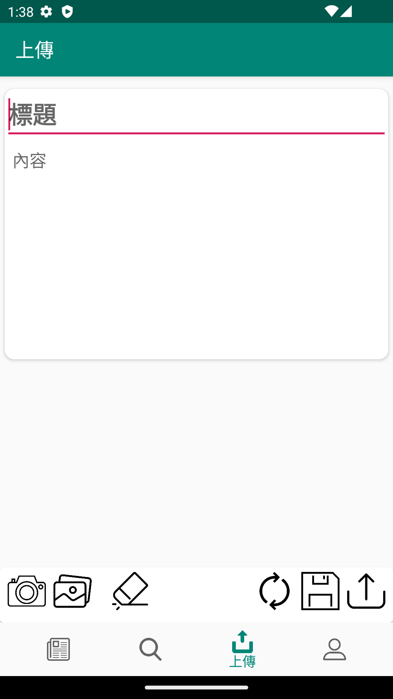

## 貼文版 TWB - 文章分享系統 Tieh-Wen-Ban

>手機論壇APP，介面類似Dcard，附上PTT的推與噓評價模式，圖片或文字皆可上傳。
### 特色
* App端為Android
* 套件使用 Glide, RxJava, okhttp, recyclerview....
* MVP架構
* HTTPs Request

## 預覽
* 首頁   
* 搜尋文章   
* 瀏覽文章   
* 會員系統   
* 發佈文章   

## 開發文件
* [OOA](https://docs.google.com/document/d/1wbsUrCHoMuGITn17n10tr4O1rahnpECfEumeSsxZWsg/edit?usp=sharing
  )
* [OOD](https://drive.google.com/open?id=1Lj5qjH7dTcb_n7QX2Yv7F42yhO4wy91ceUf6sDiTwrs
  )

* [OOT](https://docs.google.com/document/d/17GrBU515vIzOSzzrF3Gdsp4sN2DUstHVmC5bYW-nEg0/edit?usp=sharing
  )

# OFFICIAL LATEST RELEASE
* [release 1.0](https://github.com/kable2580/TWB/releases/tag/1.0)
